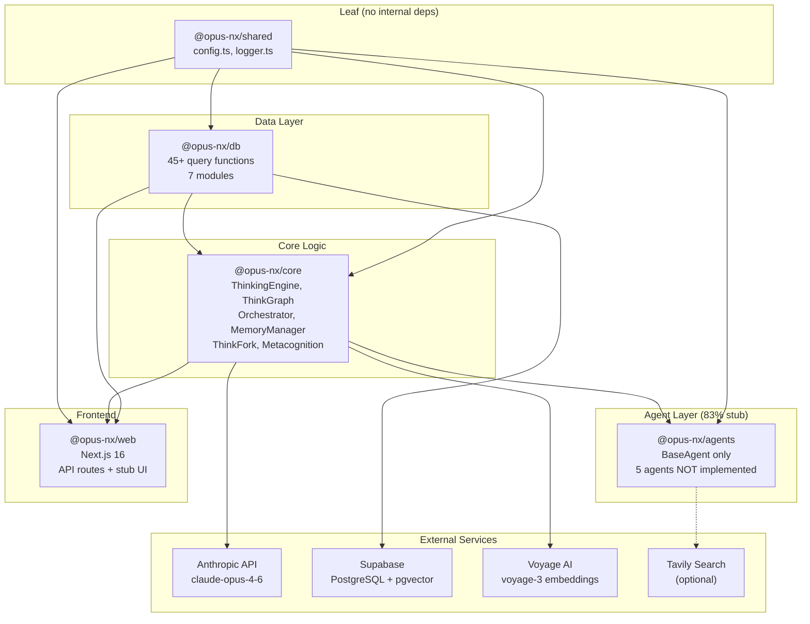

# Opus-NX Monorepo Audit: Reliability-First Enhancement Plan

## Context

This audit was triggered by the need to establish ground truth about the opus-nx codebase — what's implemented, what's claimed but missing, where silent failures hide, and how all components relate. The codebase was built for the Cerebral Valley Hackathon (Feb 2026) and has strong backend foundations but significant frontend gaps, silent failure patterns, and doc-code drift. This plan delivers scorecards, relationship maps, a silent-failure matrix, a missing-feature gap map, and a risk-prioritized backlog with acceptance criteria.

---

## 1. Folder Scorecards

### Scoring Scale
- **5** = Production-ready, well-tested, documented
- **4** = Solid with minor gaps
- **3** = Functional but has risks
- **2** = Partial/incomplete, notable issues
- **1** = Stub/placeholder/broken

---

### 1.1 `apps/web` — Next.js 16 Dashboard

| Dimension | Score | Evidence |
|-----------|-------|---------|
| Purpose | 4 | Clear: dashboard + API layer for ThinkGraph, streaming, insights |
| Dependencies | 4 | Imports @opus-nx/core, db, shared; @xyflow/react declared but underused |
| Reliability | 3 | Streaming route has good error handling; compaction node persistence silently fails; JSON parse errors in `use-thinking-stream.ts` swallowed |
| Observability | 2 | Console.log/error only, no structured logging, no correlation IDs, no metrics |
| Testability | 1 | Zero test files found |
| Doc-Code Alignment | 2 | README claims "Next.js 16 dashboard" with graph viz — only stub components exist |
| **Key Risks** | | Streaming JSON parse silent failure; compaction persistence warn-and-continue; no input validation on API params; cookie-only auth with no rate limiting |
| **Enhancement Ideas** | | Standardize API error envelope; add streaming timeout + degraded-state flags; validate UUID/pagination params; surface graph persistence status to client; add rate limiting to auth |

**Files of Note:**
- `apps/web/src/app/api/thinking/stream/route.ts` — Main streaming route, compaction node persistence silently fails (lines 138-162)
- `apps/web/src/lib/hooks/use-thinking-stream.ts` — Client streaming hook, JSON.parse errors in empty catch block (line 173)
- `apps/web/src/app/api/sessions/[sessionId]/nodes/route.ts` — N+1 edge query via `Promise.all(nodes.map(getEdgesFromNode))` (lines 19-22)
- `apps/web/src/app/api/auth/route.ts` — No rate limiting, no audit logging
- `apps/web/src/app/api/seed/route.ts` — All-or-nothing persistence with no partial recovery

---

### 1.2 `packages/core` — ThinkingEngine, ThinkGraph, Orchestrator, MemoryManager, ThinkFork, Metacognition

| Dimension | Score | Evidence |
|-----------|-------|---------|
| Purpose | 5 | Core cognitive architecture: thinking, graph persistence, orchestration, memory, forking |
| Dependencies | 4 | @opus-nx/db, @opus-nx/shared, @anthropic-ai/sdk — clean chain |
| Reliability | 3 | Orchestrator has good graceful degradation for graph persistence; MemoryManager has no circuit breaker; knowledge context retrieval throws uncaught; validation fallback uses raw data |
| Observability | 3 | Logger used consistently in core; missing correlation IDs; no metrics export |
| Testability | 2 | `test-think-graph.ts` exists but no test framework; no unit tests |
| Doc-Code Alignment | 3 | ThinkGraph, ThinkFork, Orchestrator match docs; MetacognitionEngine exists as class but no active inference; Contradiction resolution not implemented |
| **Key Risks** | | `toDBStructuredReasoning()` falls back to raw data on validation failure; `toDBTokenUsage()` same pattern; knowledge context retrieval can crash orchestrator; no embedding service circuit breaker; confidence scoring has artificial ±0.06 jitter |
| **Enhancement Ideas** | | Add circuit breaker for Voyage AI; wrap knowledge context in try-catch; reject invalid data instead of using raw fallback; add token bounds validation; implement active metacognition inference |

**Error Handling Scores by Component:**
| Component | Score | Primary Gap |
|-----------|-------|-------------|
| ThinkingEngine | 2/5 | No error handling, no retry |
| ThinkGraph | 3/5 | Partial isolation, validation fallback to raw data |
| Orchestrator | 3/5 | Good isolation, missing knowledge context degradation |
| MemoryManager | 2/5 | No retry, no circuit breaker |
| ThinkForkEngine | 4/5 | Good fallbacks, errors aggregated |
| MetacognitionEngine | 4/5 | Comprehensive error collection |

---

### 1.3 `packages/db` — Supabase Client, Queries, Migrations

| Dimension | Score | Evidence |
|-----------|-------|---------|
| Purpose | 5 | Database access layer: 45+ query functions across 7 modules |
| Dependencies | 3 | @supabase/supabase-js, @opus-nx/shared — clean but no connection health check |
| Reliability | 3 | metacognition.ts has excellent fallback (5/5); knowledge.ts has timestamp bug; getActiveSessions returns [] on error; tokensUsed defaults to 0 on null |
| Observability | 2 | No logging in any query function; errors wrapped in generic messages |
| Testability | 1 | No tests |
| Doc-Code Alignment | 4 | Schema matches docs; types match schema with minor gaps |
| **Key Risks** | | `searchKnowledge()` hardcodes timestamps to `new Date()` instead of row values (CRITICAL BUG); `getFirstNodePerSessions()` loads ALL nodes then deduplicates in memory; all mappers use unsafe `as` casts with no validation; tokensUsed defaults mask missing data |
| **Enhancement Ideas** | | Fix searchKnowledge timestamps; fix getFirstNodePerSessions with DISTINCT ON; add Zod validation in mappers; add embedding dimension validation (must be 1024); add full-text search fallback to knowledge.ts (copy metacognition.ts pattern) |

**Module Error Handling Scores:**
| Module | Score | Note |
|--------|-------|------|
| metacognition.ts | 5/5 | Full-text fallback to ILIKE, batch support |
| thinking-nodes.ts | 4/5 | Good RPC handling, helper functions |
| sessions.ts | 3/5 | getActiveSessions silent failure |
| knowledge.ts | 3/5 | Timestamp bug, no fallback |
| agent-runs.ts | 3/5 | No state transition validation |
| decisions.ts | 2/5 | Basic error wrapping only |
| client.ts | 2/5 | No connection test |

---

### 1.4 `packages/shared` — Config, Logger, Utilities

| Dimension | Score | Evidence |
|-----------|-------|---------|
| Purpose | 4 | Config loading with Zod validation, structured logger |
| Dependencies | 5 | Only zod and yaml — minimal, correct |
| Reliability | 4 | Zod validation is strong; `watchConfig()` silently continues on reload failure; logger throws on circular references |
| Observability | 3 | Logger exists but no JSON output mode; ANSI colors emitted to log files; no per-module log level control |
| Testability | 1 | No tests |
| Doc-Code Alignment | 4 | CLAUDE.md accurately describes config patterns |
| **Key Risks** | | `watchConfig()` uses stale config on reload failure; `logger.ts` `JSON.stringify` can throw on circular references; TAVILY_API_KEY optional but some code may assume it exists |
| **Enhancement Ideas** | | Add `process.exit(1)` or propagate error in watchConfig; add try-catch for JSON.stringify in logger; add LOG_LEVEL env var support; add per-module log level config; add JSON structured logging mode |

---

### 1.5 `packages/agents` — Sub-Agent Implementations

| Dimension | Score | Evidence |
|-----------|-------|---------|
| Purpose | 2 | Only BaseAgent class exists; 5 of 6 agents are commented-out placeholder exports |
| Dependencies | 2 | LangChain packages declared but zero imports found — dead dependencies |
| Reliability | 2 | BaseAgent has no error handling in constructor; no invoke() default; no cleanup/destroy |
| Observability | 1 | No logging |
| Testability | 1 | No tests |
| Doc-Code Alignment | 1 | agents.yaml defines 5 agents with tools/prompts; only BaseAgent exported; 83% not implemented |
| **Key Risks** | | Orchestrator references agent routing but agents don't exist; agent tool definitions in YAML have no corresponding implementations; LangChain dead dependency adds ~50MB to node_modules |
| **Enhancement Ideas** | | Implement at least ResearchAgent and KnowledgeAgent; add invoke() base implementation with try-catch/timeout; add config validation in BaseAgent constructor; remove unused LangChain deps or implement agents |

---

### 1.6 `configs/` — Agent Definitions, Categories, Prompts

| Dimension | Score | Evidence |
|-----------|-------|---------|
| Purpose | 4 | Agent configs, knowledge taxonomy, system prompts, ThinkFork variants |
| Dependencies | 3 | agents.yaml validated by Zod schema; categories.yaml has NO schema and is NEVER loaded |
| Reliability | 3 | Prompt files exist and are well-structured; no version management; no fallback if files missing (except ThinkFork) |
| Observability | 1 | No logging of config loads/reloads |
| Testability | 1 | No validation tests |
| Doc-Code Alignment | 3 | Agent descriptions match ARCHITECTURE.md; categories.yaml matches knowledge.md prompt but is never enforced in code |
| **Key Risks** | | categories.yaml declared but never loaded — taxonomy is documentation-only; agent tool names not validated against AgentToolSchema; systemPromptPath files not validated to exist at startup; agent names hardcoded in `buildRoutingTools()` instead of derived from config |
| **Enhancement Ideas** | | Load and validate categories.yaml at startup; validate systemPromptPath existence; derive agent names from config instead of hardcoding; add config version tracking; validate tool names against schema |

---

### 1.7 `scripts/` — Test & Migration Scripts

| Dimension | Score | Evidence |
|-----------|-------|---------|
| Purpose | 3 | Only `test-connections.ts` exists — thorough API connection tester |
| Dependencies | 4 | Uses Node.js fetch API, no shell commands — cross-platform safe |
| Reliability | 2 | **CRITICAL: Script exits with code 0 even on failure** — `process.exit(1)` never called |
| Observability | 3 | Color-coded output, clear pass/fail reporting |
| Testability | 1 | No tests for the test script itself |
| Doc-Code Alignment | 3 | CLAUDE.md doesn't reference this script |
| **Key Risks** | | CI/CD cannot detect failure (always exit 0); no migration runner script; no database seeding script; no setup wizard |
| **Enhancement Ideas** | | Add `process.exit(1)` on test failure; create `scripts/seed.ts`; create `scripts/setup.ts` for first-time setup; create `scripts/migrate.ts` to actually run migrations |

---

### 1.8 `supabase/` — Migrations & Schema

| Dimension | Score | Evidence |
|-----------|-------|---------|
| Purpose | 5 | 2 well-structured migrations: initial schema + thinking graph |
| Dependencies | 4 | pgvector for embeddings, proper FK constraints |
| Reliability | 3 | All CREATE use IF NOT EXISTS (idempotent); `get_reasoning_chain` RPC has no max depth protection (infinite loop risk); `get_session_reasoning_context` has N+1 subquery pattern; `traverse_reasoning_graph` has edge type mismatch ('branches_from' in RPC but not in table constraint) |
| Observability | 1 | No audit logging, no query metrics |
| Testability | 1 | No migration tests |
| Doc-Code Alignment | 4 | Schema matches ARCHITECTURE.md |
| **Key Risks** | | **NO RLS policies** — any authenticated user can read/write all data; `get_reasoning_chain` can infinite-loop on cyclic data; N+1 in `get_session_reasoning_context`; `branches_from` edge type in RPC but not in table constraint |
| **Enhancement Ideas** | | Add RLS policies for all tables (CRITICAL); add max depth to get_reasoning_chain; fix N+1 with LEFT JOIN + GROUP BY; align edge types between RPC and constraint; add missing indexes (composite session_id+created_at) |

---

### 1.9 Root Docs & Config

| Dimension | Score | Evidence |
|-----------|-------|---------|
| Purpose | 4 | README, ARCHITECTURE.md, PRD.md, ROADMAP.md, CLAUDE.md — comprehensive documentation set |
| Dependencies | 4 | turbo.json properly declares build dependencies; pnpm workspaces configured |
| Reliability | 3 | `pnpm db:migrate` just echoes an instruction — doesn't actually migrate; no pre-commit hooks |
| Observability | 2 | No CI/CD configuration found |
| Testability | 2 | `pnpm test` wired to turbo but limited test files exist |
| Doc-Code Alignment | 2 | README claims features not implemented (dashboard viz, metacognition engine, contradiction resolution); .env.example marks Tavily as "Required" but code treats it as optional |
| **Key Risks** | | Doc-code drift creates false expectations; `db:migrate` script is a no-op; .env.example incomplete (missing PORT, NODE_ENV, LOG_LEVEL); typecheck depends on ^build which could race |
| **Enhancement Ideas** | | Update README to reflect actual implementation status; fix db:migrate to actually run migrations; expand .env.example with all variables; add CI/CD pipeline; add pre-commit hooks |

---

## 2. Relationship Maps

### Map A: Package Dependency Graph (Mermaid)



**Adjacency Table:**

| Package | Depends On | Depended By |
|---------|-----------|-------------|
| @opus-nx/shared | (none) | db, core, agents, web |
| @opus-nx/db | shared | core, web |
| @opus-nx/core | db, shared, @anthropic-ai/sdk | agents, web |
| @opus-nx/agents | core, db, shared, @langchain/* (unused) | (none — not consumed) |
| @opus-nx/web | core, db, shared, next, @xyflow/react | (none — leaf app) |

---

### Map B: Runtime Request Flow (Major User Actions)

#### B1: Thinking Stream (Primary Flow)

```
User types message in UI
  |
  v
POST /api/thinking/stream
  |
  +--> Validate auth cookie (middleware.ts)
  +--> Parse request body { prompt, sessionId?, thinkingBudget? }
  |
  v
Create/resume session (db: createSession/getSession)
  |
  v
ThinkingEngine.thinkStream(prompt, config)
  +--> Anthropic API: POST /v1/messages (streaming)
  +--> Emit SSE events: { type: "thinking" | "text" | "done" }
  |
  v
ThinkGraph.persistThinkingNode(thinkingBlocks, options)
  +--> Parse structured reasoning from thinking text
  +--> Extract decision points (pattern matching)
  +--> db: createThinkingNode()
  +--> db: createReasoningEdge() (link to parent, if exists)
  +--> db: createDecisionPoints() (batch)
  |
  +--> [ON FAILURE: log error, continue without graph -- SILENT]
  |
  v
Emit final SSE: { type: "result", thinkingNode, decisionPoints }
  |
  v
Client: use-thinking-stream.ts processes SSE events
  +--> JSON.parse each "data:" line
  +--> [ON PARSE FAILURE: empty catch block -- SILENT]
  +--> Update React state: thinking text, response, phase
```

#### B2: ThinkFork (Parallel Reasoning)

```
POST /api/thinking/fork
  |
  v
ThinkForkEngine.fork(query, options)
  |
  +--> Load style prompts from configs/prompts/thinkfork/
  +--> For each style (conservative, balanced, aggressive, contrarian):
  |     +--> ThinkingEngine.think(prompt + style system prompt)
  |     +--> Parse response into ForkBranch
  |     (runs in parallel via Promise.allSettled)
  |
  +--> analyzeComparison(query, branches)
  |     +--> ThinkingEngine.think(comparison prompt)
  |     +--> Extract convergence/divergence points
  |     +--> [ON FAILURE: fallback to basic meta-insight]
  |
  v
Return ForkResult { branches[], convergencePoints, divergencePoints, metaInsight }
```

#### B3: Metacognitive Insights

```
GET /api/insights?sessionId=X&nodeLimit=20
  |
  v
MetacognitionEngine.analyze({ sessionId, nodeLimit, focusAreas })
  |
  +--> gatherReasoningContext(sessionId, nodeLimit)
  |     +--> db: getSessionThinkingNodes()
  |     +--> db: getDecisionPoints() per node
  |     +--> [ON FAILURE: returns error message in result]
  |
  +--> ThinkingEngine.think(metacognition prompt + reasoning context)
  |     +--> Anthropic API with 50k thinking budget
  |     +--> Parse insights from response
  |
  +--> db: createMetacognitiveInsights() (batch persist)
  |
  v
Return { insights[], nodesAnalyzed, summary }
```

#### B4: Session List + Enrichment

```
GET /api/sessions
  |
  v
db: getActiveSessions()
  +--> [ON FAILURE: returns [] -- SILENT, indistinguishable from "no sessions"]
  |
  v
db: getFirstNodePerSessions(sessionIds)
  +--> Loads ALL thinking nodes for sessions
  +--> Deduplicates in memory (unreliable ordering)
  +--> [BUG: may return wrong "first" node]
  |
  v
Enrich each session with first node's inputQuery as display name
  |
  v
Return enriched session list to UI
```

---

### Map C: Data/Persistence Flow

```
                    API Input
                       |
          +------------+-------------+
          |            |             |
     ThinkingReq   ForkReq     SearchReq
          |            |             |
          v            v             v
    +-----------+  +---------+  +----------+
    | thinking_ |  | fork    |  | search   |
    | blocks[]  |  | styles  |  | query    |
    +-----------+  +---------+  +----------+
          |            |             |
          v            v             v
    +----------------------------------------+
    |         Domain Models (core)            |
    | ThinkingNode, DecisionPoint,            |
    | ReasoningEdge, ForkBranch,              |
    | MetacognitiveInsight, KnowledgeEntry    |
    +----------------------------------------+
          |
          v (persist)
    +----------------------------------------+
    |          Supabase Tables                |
    | thinking_nodes    | reasoning_edges     |
    | decision_points   | contradictions      |
    | sessions          | metacognitive_*     |
    | knowledge_entries | knowledge_relations |
    | decision_log      | agent_runs          |
    +----------------------------------------+
          |
          v (query/return)
    +----------------------------------------+
    |         View Models (API response)      |
    | SerializedNode, SerializedEdge,         |
    | SessionWithEnrichment, InsightResult    |
    +----------------------------------------+
          |
          v
      API Response / SSE Stream
```

**Contract Table:**

| Domain Model | DB Table | Transform Location | Known Drift |
|-------------|----------|-------------------|-------------|
| ThinkingNode | thinking_nodes | db/thinking-nodes.ts:mapThinkingNode | structuredReasoning defaults to {} on null |
| ReasoningEdge | reasoning_edges | db/thinking-nodes.ts:mapReasoningEdge | None detected |
| DecisionPoint | decision_points | db/thinking-nodes.ts:mapDecisionPoint | None detected |
| Session | sessions | db/sessions.ts:mapSession | status not enum-validated |
| KnowledgeEntry | knowledge_entries | db/knowledge.ts:mapKnowledgeEntry | None detected |
| KnowledgeSearchResult | (RPC result) | db/knowledge.ts inline mapping | **createdAt/updatedAt hardcoded to new Date()** |
| MetacognitiveInsight | metacognitive_insights | db/metacognition.ts:mapMetacognitiveInsight | insightType not enum-validated |
| AgentRun | agent_runs | db/agent-runs.ts:mapAgentRun | tokensUsed.input/output default 0 on null |
| DecisionLogEntry | decision_log | db/decisions.ts:mapDecisionLogEntry | tokensUsed.input/output default 0 on null |

---

### Map D: Config/Prompt Influence Graph

| Source | Consumer | Fallback | Failure Mode |
|--------|----------|----------|-------------|
| `.env` ANTHROPIC_API_KEY | shared/config.ts -> core/ThinkingEngine | None | App crash at startup |
| `.env` SUPABASE_URL | shared/config.ts -> db/client.ts | None | App crash at startup |
| `.env` SUPABASE_SERVICE_ROLE_KEY | shared/config.ts -> db/client.ts | None | App crash at startup |
| `.env` SUPABASE_ANON_KEY | shared/config.ts -> web middleware | None | App crash at startup |
| `.env` VOYAGE_API_KEY | shared/config.ts -> core/MemoryManager | None | App crash at startup |
| `.env` TAVILY_API_KEY | shared/config.ts (optional) | Skip Tavily | Silent — research agent limited |
| `configs/agents.yaml` | core/Orchestrator constructor | None | App crash |
| `configs/categories.yaml` | **NOTHING** (never loaded) | N/A | Taxonomy is docs-only |
| `configs/prompts/orchestrator.md` | core/Orchestrator | None | Crash on missing |
| `configs/prompts/thinkfork/*.md` | core/ThinkForkEngine | Inline fallback prompts | Degraded quality |
| `configs/prompts/research.md` | (Not consumed — agents not implemented) | N/A | N/A |
| `configs/prompts/code.md` | (Not consumed — agents not implemented) | N/A | N/A |
| `configs/prompts/knowledge.md` | (Not consumed — agents not implemented) | N/A | N/A |
| `configs/prompts/planning.md` | (Not consumed — agents not implemented) | N/A | N/A |
| `configs/prompts/communication.md` | (Not consumed — agents not implemented) | N/A | N/A |
| `configs/prompts/metacognition.md` | core/MetacognitionEngine | None | Crash on missing |
| Hardcoded system prompt | web/api/thinking/route.ts (line 54) | N/A | **Ignores orchestrator.md** |
| Hardcoded agent enum | core/orchestrator.ts:buildRoutingTools | N/A | **Ignores agents.yaml keys** |

---

## 3. Silent Failure Matrix

### P0 — Data Loss / Corruption / False-Success

| # | Location | Trigger | Current Behavior | User Impact | Data Risk | Detection Gap | Proposed Fix | Owner |
|---|----------|---------|-----------------|-------------|-----------|--------------|-------------|-------|
| 1 | `db/knowledge.ts:93-94` | Any call to `searchKnowledge()` | createdAt/updatedAt hardcoded to `new Date()` | Knowledge freshness tracking broken; sort by date wrong | Incorrect metadata persisted to consumers | None — all results look "just created" | Use `row.created_at`/`row.updated_at` | packages/db |
| 2 | `supabase/migrations/*` | Production with multiple users | **No RLS policies on any table** | Any user can read/modify all other users' data | Full data exposure | None until security audit | Add RLS policies for all tables | supabase |
| 3 | `db/thinking-nodes.ts:213-240` | Session list with many nodes | `getFirstNodePerSessions()` loads ALL nodes, deduplicates in memory | May return wrong "first" node; excess memory | Wrong display names | Undetectable without load testing | Use SQL `DISTINCT ON (session_id)` | packages/db |
| 4 | `db/decisions.ts:125-126`, `db/agent-runs.ts:175-176` | Null tokensUsed in DB | Defaults input/output to 0 instead of undefined | Token cost tracking reports 0 instead of unknown | False accounting data | Looks like free API calls | Return `undefined` instead of `{ input: 0, output: 0 }` | packages/db |

### P1 — User-Visible Inconsistency / Degraded Without Error

| # | Location | Trigger | Current Behavior | User Impact | Data Risk | Detection Gap | Proposed Fix | Owner |
|---|----------|---------|-----------------|-------------|-----------|--------------|-------------|-------|
| 5 | `web/hooks/use-thinking-stream.ts:173` | Malformed SSE chunk | JSON.parse in empty catch block | Stream appears frozen, no error shown | None | No logging, no telemetry | Set error state, cancel reader, log event | apps/web |
| 6 | `web/api/thinking/stream/route.ts:138-162` | DB error during compaction | Warns and continues; compaction reported but node not persisted | Graph shows compaction but relationship unclear | Compaction boundary lost | Warn-level log only | Retry + emit degraded-state SSE event | apps/web |
| 7 | `core/orchestrator.ts:260-287` | DB error during thinking persist | Logs ERROR but returns result without `thinkingNode` | Response succeeds but graph chain broken; `lastThinkingNodeId` not updated | Graph fragmentation | Error logged but result doesn't indicate failure | Add `graphPersisted: false` flag to result | packages/core |
| 8 | `core/orchestrator.ts:231-234` | Voyage AI or DB error during knowledge retrieval | Exception propagates — entire response fails (500) | User gets 500 instead of degraded response | None | 500 errors visible but cause unclear | Wrap in try-catch, continue with empty context | packages/core |
| 9 | `db/sessions.ts:158` | DB connection failure | `getActiveSessions()` returns `[]` | "No sessions" shown instead of error | None | Indistinguishable from empty state | Throw on error, let caller handle | packages/db |
| 10 | `core/think-graph.ts:83-92` | Invalid structured reasoning | Logs warn, uses raw (unvalidated) data | Graph may contain corrupt structured_reasoning | Invalid data persisted | Warn-level log only | Return default empty structure instead of raw data | packages/core |
| 11 | `supabase 002:292-337` | Cyclic parent_node_id in data | `get_reasoning_chain` RPC has no max depth | Query timeout, DB resource exhaustion | None (query never returns) | PostgreSQL statement timeout | Add `AND chain_position < 100` to recursive CTE | supabase |
| 12 | `supabase 002:252` | Any call to `getSessionReasoningContext` | N+1: COUNT subquery per node | 20 nodes = 21 queries; slow response | Performance degradation | Only visible in query logs | Use LEFT JOIN + GROUP BY | supabase |
| 13 | `supabase 002:171` | Edge type 'branches_from' used in code | RPC allows it but table constraint rejects it | Insert fails with constraint error | None | DB error at insert time | Align RPC valid_edge_types with table constraint | supabase |

### P2 — Observability / Documentation Debt

| # | Location | Trigger | Current Behavior | User Impact | Data Risk | Detection Gap | Proposed Fix | Owner |
|---|----------|---------|-----------------|-------------|-----------|--------------|-------------|-------|
| 14 | `shared/config.ts:34` | Config file becomes invalid YAML | `watchConfig()` logs error, continues with stale config | Stale settings persist without notice | None | Console.error only | Propagate error or emit event | packages/shared |
| 15 | `shared/logger.ts:37` | Context with circular reference | `JSON.stringify` throws | Log message lost entirely | None | No detection | Add try-catch with fallback string | packages/shared |
| 16 | `db/knowledge.ts:36` | Embedding not 1024-dim | Passed to Supabase without validation | Similarity search returns garbage results | Wrong search results | No validation | Assert `embedding.length === 1024` | packages/db |
| 17 | `core/think-graph.ts:557-569` | Every confidence score | Adds deterministic ±0.06 jitter for "visual variety" | Confidence scores are artificially noisy | Unreliable confidence data | By design | Remove jitter or document it explicitly | packages/core |
| 18 | `configs/categories.yaml` | Always | File loaded by nothing; taxonomy never enforced | Any category string accepted in knowledge entries | Taxonomy corruption | No detection | Load categories.yaml, validate on insert | configs |
| 19 | `scripts/test-connections.ts:203-229` | Test failures | Always exits code 0 | CI/CD cannot detect failures | None | Exit code always 0 | Add `process.exit(1)` when `!allPassed` | scripts |
| 20 | All `db/*.ts` mapper functions | Invalid types from DB | Unsafe `as` casts with no runtime validation | TypeScript type safety violated at runtime | Type errors deferred to consumers | None | Add Zod validation in mappers | packages/db |

---

## 4. Missing Feature Gap Map

| Claimed Capability | Source Doc | Implementation Status | Gap Type | Required Components | Priority |
|-------------------|-----------|----------------------|----------|-------------------|----------|
| Graph visualization — "navigate reasoning chains visually" | PRD US-1.1, README | DB + RPC ready; **no UI component** | Not implemented (frontend) | @xyflow/react component, node inspector panel, edge rendering | P0 |
| Metacognitive self-audit — "detect biases, identify patterns" | PRD US-2, README | Schema + MetacognitionEngine class exist; **no active inference** | Partially implemented | Active Claude call with 50k thinking budget, insight extraction, persistence | P0 |
| Contradiction resolution — "reason through conflicting information" | PRD US-4, README | `contradictions` table exists; **no detection or resolution logic** | Not implemented | Detection algorithm, resolution prompt, resolution logic, audit trail | P1 |
| Specialized agents — research, code, knowledge, planning, communication | agents.yaml, ARCHITECTURE.md | Only BaseAgent exported; **5 agents commented out** | Not implemented | Agent classes, tool framework, LangGraph workflows | P1 |
| Dashboard UI — "ThinkGraph Explorer, ThinkFork Viewer, Metacog Insights" | ROADMAP Day 4, README | API routes exist; **stub components only** | Not implemented (frontend) | React components, state management, data fetching hooks | P0 |
| Export reasoning graphs | PRD US-1.6 | **Not implemented at all** | Not implemented | Export logic (JSON/SVG/PNG), download endpoint | P2 |
| Natural language search UI for reasoning | PRD US-1.3 | `search_reasoning_nodes` RPC exists; **no search UI** | Partially implemented | Search input component, results display, highlighting | P1 |
| Auto-tagging from categories.yaml autoTags | categories.yaml | autoTags defined; **not loaded, not used** | Not implemented | Load categories, pattern-match content, apply tags | P2 |
| Agent tool calling framework | agents.yaml tools[] | Tool names defined; **no tool interface, no implementations** | Not implemented | Tool schema, tool registry, tool execution in BaseAgent | P1 |
| Hardcoded agent routing vs config-driven | orchestrator.ts:buildRoutingTools | Agent enum hardcoded `["research", "code", ...]`; **should derive from agents.yaml** | Contract drifted | Read agent keys from config, generate routing tools dynamically | P1 |
| Non-streaming thinking route uses hardcoded prompt | web/api/thinking/route.ts:54 | Hardcoded string; **ignores orchestrator.md** | Contract drifted | Load and use orchestrator.md system prompt | P2 |
| .env.example claims Tavily "Required" | .env.example | Code treats TAVILY_API_KEY as optional | Contract drifted | Update .env.example or make truly required | P2 |

---

## 5. Enhancement Backlog (Prioritized)

### P0 — Must Fix (Data Integrity / Silent Failures / Core Gaps)

| # | Epic | Issue | Owner Folder | Effort | Risk Reduction | Acceptance Criteria |
|---|------|-------|-------------|--------|---------------|-------------------|
| P0-1 | Data Integrity | Fix `searchKnowledge()` timestamp bug — use `row.created_at`/`row.updated_at` instead of `new Date()` | packages/db | 5 min | Eliminates false freshness data | `searchKnowledge()` returns actual DB timestamps; verify with direct DB query comparison |
| P0-2 | Security | Add RLS policies to all Supabase tables | supabase | 2 hr | Prevents cross-user data leakage | Each table has INSERT/SELECT/UPDATE/DELETE policies scoped to `auth.uid()`; test with two different users |
| P0-3 | Data Integrity | Fix `getFirstNodePerSessions()` — use `DISTINCT ON (session_id)` | packages/db | 30 min | Correct first-node selection, reduced memory | Returns same result as `SELECT DISTINCT ON (session_id) ... ORDER BY session_id, created_at ASC`; memory usage proportional to session count, not node count |
| P0-4 | Silent Failure | Fix streaming JSON parse empty catch — set error state + cancel reader | apps/web | 10 min | Users see error instead of frozen stream | Malformed SSE triggers error state in UI with message; stream reader cancelled |
| P0-5 | Silent Failure | Wrap orchestrator knowledge context retrieval in try-catch | packages/core | 15 min | Prevents 500 on embedding failure | Orchestrator returns response (degraded quality) even when Voyage AI is down |
| P0-6 | Data Integrity | Stop using raw data on validation failure in `toDBStructuredReasoning()` / `toDBTokenUsage()` — return empty default instead | packages/core | 20 min | Prevents corrupt data in DB | Failed validation produces empty/default structure, not raw unvalidated data |
| P0-7 | Silent Failure | Fix `getActiveSessions()` to throw on DB error instead of returning `[]` | packages/db | 10 min | Callers can distinguish "no sessions" from "DB error" | Error thrown on DB failure; API route returns 500 with message |
| P0-8 | Data Integrity | Fix tokensUsed defaulting to 0 — return `undefined` on null | packages/db | 15 min | Token accounting shows unknown vs zero | Null DB value maps to `undefined`, not `{ input: 0, output: 0 }` |
| P0-9 | Script Safety | Add `process.exit(1)` to `test-connections.ts` on failure | scripts | 5 min | CI/CD can detect failures | Script exits non-zero when any connection test fails |

### P1 — High Priority (Reliability / Performance / Key Gaps)

| # | Epic | Issue | Owner Folder | Effort | Risk Reduction | Acceptance Criteria |
|---|------|-------|-------------|--------|---------------|-------------------|
| P1-1 | Performance | Fix N+1 edge query in sessions/[sessionId]/nodes route — add batch `getEdgesForSession()` | packages/db, apps/web | 1 hr | 100+ queries reduced to 1 | Single DB query fetches all edges for session; response time <500ms for 100 nodes |
| P1-2 | Performance | Fix `get_session_reasoning_context` N+1 subquery — use LEFT JOIN + GROUP BY | supabase | 1 hr | 21 queries reduced to 1 per RPC call | `EXPLAIN` shows single scan; response time <100ms for 20 nodes |
| P1-3 | Stability | Add max depth protection to `get_reasoning_chain` RPC | supabase | 15 min | Prevents infinite loop on cyclic data | `AND chain_position < 100` in recursive CTE; test with cyclic data returns limited result |
| P1-4 | Stability | Add circuit breaker for Voyage AI embeddings in MemoryManager | packages/core | 1 hr | Prevents cascading failures when embeddings down | After 3 failures in 60s, circuit opens; auto-resets after cooldown; orchestrator continues without embeddings |
| P1-5 | Data Integrity | Validate embedding dimensions (must be 1024) in `createKnowledgeEntry()` | packages/db | 10 min | Prevents garbage similarity search | `embedding.length !== 1024` throws descriptive error |
| P1-6 | Data Integrity | Add UUID format validation on API route params | apps/web | 15 min | Catches invalid IDs early | Invalid UUID returns 400 with message instead of cryptic DB error |
| P1-7 | Config Integrity | Align RPC edge type validation with table constraint (remove 'branches_from') | supabase | 10 min | Prevents constraint violation errors | `valid_edge_types` in RPC matches table CHECK constraint exactly |
| P1-8 | Observability | Surface graph persistence status to streaming client | apps/web | 20 min | UI can warn if graph incomplete | SSE event `{ type: "graph_status", persisted: bool, linkedToParent: bool }` emitted |
| P1-9 | Config Integrity | Derive agent routing enum from agents.yaml instead of hardcoding | packages/core | 30 min | Config changes don't require code changes | `buildRoutingTools()` reads agent keys from `this.agentsConfig.agents` |
| P1-10 | Reliability | Add full-text search fallback to `searchKnowledge()` (copy metacognition.ts pattern) | packages/db | 1 hr | Knowledge search works even when RPC fails | On RPC error, falls back to ILIKE search with logged warning |
| P1-11 | Observability | Add structured logging to all db query functions | packages/db | 2 hr | Debug production issues | Every query function logs operation, params, duration, result count |

### P2 — Medium Priority (Polish / Observability / Gaps)

| # | Epic | Issue | Owner Folder | Effort | Risk Reduction | Acceptance Criteria |
|---|------|-------|-------------|--------|---------------|-------------------|
| P2-1 | Observability | Add correlation ID propagation via AsyncLocalStorage | packages/shared | 2 hr | Request tracing across all layers | Every log entry includes requestId; can trace full request path |
| P2-2 | Logger | Fix circular reference crash in logger — add try-catch for JSON.stringify | packages/shared | 10 min | Logger never throws | Circular ref context logs `[unstringifiable context]` instead of throwing |
| P2-3 | Logger | Add LOG_LEVEL env var and per-module log level support | packages/shared | 1 hr | Runtime log control without restart | `LOG_LEVEL=db:debug,core:info` controls per-module verbosity |
| P2-4 | Config | Load and validate categories.yaml at startup | configs, packages/core | 1 hr | Taxonomy enforced | Invalid category in `createKnowledgeEntry()` throws validation error |
| P2-5 | Config | Validate systemPromptPath file existence at config load time | packages/core | 30 min | Fail-fast on missing prompt files | Missing prompt file detected at startup, not at first agent call |
| P2-6 | Scripts | Create `scripts/setup.ts` first-time setup wizard | scripts | 2 hr | Better onboarding | `pnpm setup` validates env, tests connections, runs migrations |
| P2-7 | Scripts | Create actual migration runner in `pnpm db:migrate` | scripts | 1 hr | Automated schema deployment | `pnpm db:migrate` runs migrations against configured Supabase instance |
| P2-8 | Security | Add rate limiting to auth route | apps/web | 30 min | Prevents brute force | >5 attempts per minute from same IP returns 429 |
| P2-9 | Config Watchdog | Propagate watchConfig errors instead of silent continue | packages/shared | 30 min | Stale config detected | Config reload failure emits event or throws; app can react |
| P2-10 | Data Integrity | Add Zod validation in all db mapper functions | packages/db | 3 hr | Runtime type safety at DB boundary | Each mapper uses `.safeParse()` with fallback logging |
| P2-11 | Docs | Update README to reflect actual implementation status | root | 1 hr | Honest documentation | Each feature marked as Implemented/Partial/Planned |
| P2-12 | Performance | Add streaming timeout detection (5 min idle) | apps/web | 20 min | Graceful handling of hung connections | After 5 min with no events, stream error state shown |
| P2-13 | API Contracts | Standardize error envelope `{ error: { code, message, recoverable, correlationId } }` | apps/web | 2 hr | Consistent client error handling | All API routes return same error shape |
| P2-14 | Config | Remove confidence score jitter or document it as intentional | packages/core | 10 min | Principled confidence scores | Either jitter removed or CLAUDE.md documents the behavior |
| P2-15 | Dependencies | Remove unused LangChain packages from @opus-nx/agents | packages/agents | 10 min | ~50MB less in node_modules | `@langchain/*` removed from agents/package.json |

---

## 6. Verification Plan

### How to validate this audit's findings:

1. **Timestamp bug (P0-1)**: Call `searchKnowledge()`, compare result `createdAt` with DB `SELECT created_at FROM knowledge_entries` — they will differ by the query execution time
2. **RLS gap (P0-2)**: In Supabase dashboard, check "Auth policies" for any table — all show "No policies"
3. **getFirstNodePerSessions (P0-3)**: Create 2 sessions with 10+ nodes each, call function, verify it loads all nodes (check network tab or add logging)
4. **Streaming parse failure (P0-4)**: Send malformed SSE data to the stream — UI freezes with no error
5. **N+1 edges (P1-1)**: Enable Supabase query logging, load a session with 50 nodes, count queries — will show 50+ separate edge queries
6. **Exit code (P0-9)**: Run `node scripts/test-connections.ts` with invalid API key, check `echo $?` — will be 0

### Regression test scenarios for top fixes:

- API route returns explicit degraded response when graph persistence fails
- Stream parser surfaces recoverable status on malformed chunk
- Session list enrichment failure returns session with enrichment status flag
- Graph edge persistence failure observable by correlation ID
- DB full-text failure fallback records degradation metric
- Migration drift detection fails CI when supabase and package migrations diverge
- Env schema check fails startup when required secret missing
