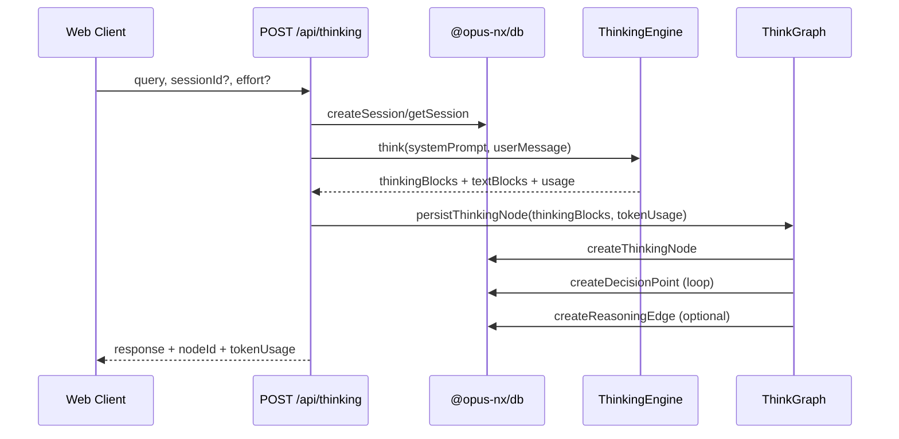
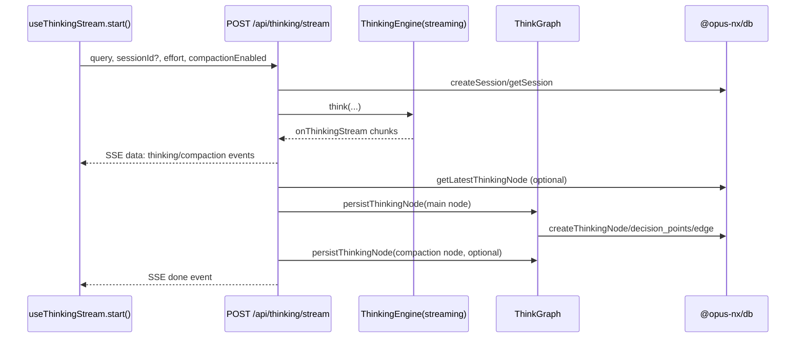
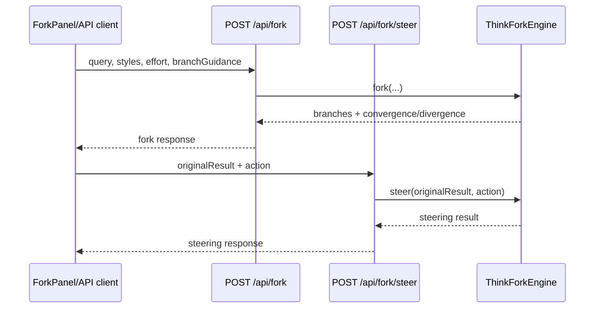
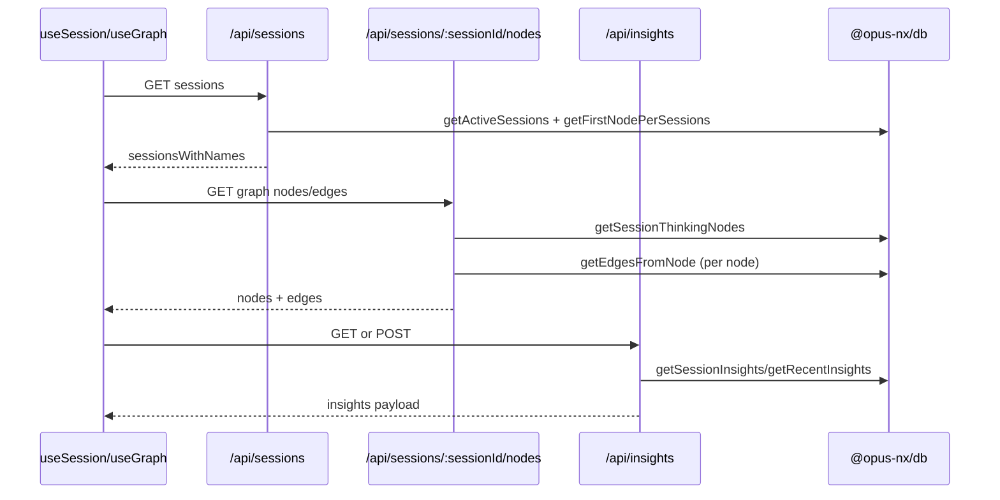
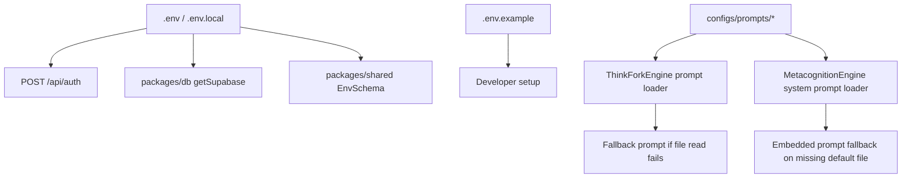

# Relationship Maps

## Map A: Package Dependencies

```mermaid
graph LR
  Root[Root Workspace]
  Web[@opus-nx/web]
  Core[@opus-nx/core]
  DB[@opus-nx/db]
  Shared[@opus-nx/shared]
  Agents[@opus-nx/agents]

  Root --> Web
  Root --> Core
  Root --> DB
  Root --> Shared
  Root --> Agents

  Web --> Core
  Web --> DB
  Web --> Shared

  Core --> DB
  Core --> Shared

  DB --> Shared

  Agents --> Core
  Agents --> DB
  Agents --> Shared
```

### Adjacency Table
| Node | Depends On | Evidence |
| --- | --- | --- |
| Root workspace | `apps/*`, `packages/*` | `pnpm-workspace.yaml:2` |
| `@opus-nx/web` | `@opus-nx/core`, `@opus-nx/db`, `@opus-nx/shared` | `apps/web/package.json:14` |
| `@opus-nx/core` | `@opus-nx/db`, `@opus-nx/shared` | `packages/core/package.json:22` |
| `@opus-nx/db` | `@opus-nx/shared` | `packages/db/package.json:23` |
| `@opus-nx/agents` | `@opus-nx/core`, `@opus-nx/db`, `@opus-nx/shared` | `packages/agents/package.json:26` |
| Web transpilation path | transpiles core/db/shared into Next app | `apps/web/next.config.ts:4` |

## Map B: Runtime API and Control Flow

### B.1 Thinking (non-streaming)

- Evidence: `apps/web/src/app/api/thinking/route.ts:15`, `apps/web/src/app/api/thinking/route.ts:53`, `apps/web/src/app/api/thinking/route.ts:68`, `packages/core/src/think-graph.ts:661`, `packages/core/src/think-graph.ts:678`.

### B.2 Thinking (streaming)

- Evidence: `apps/web/src/lib/hooks/use-thinking-stream.ts:138`, `apps/web/src/app/api/thinking/stream/route.ts:22`, `apps/web/src/app/api/thinking/stream/route.ts:79`, `apps/web/src/app/api/thinking/stream/route.ts:115`, `apps/web/src/app/api/thinking/stream/route.ts:125`, `apps/web/src/app/api/thinking/stream/route.ts:145`.

### B.3 ThinkFork and Steering

- Evidence: `apps/web/src/app/api/fork/route.ts:22`, `apps/web/src/app/api/fork/route.ts:38`, `apps/web/src/app/api/fork/steer/route.ts:56`, `apps/web/src/app/api/fork/steer/route.ts:70`.

### B.4 Sessions, Graph Retrieval, and Insights

- Evidence: `apps/web/src/lib/hooks/use-session.ts:28`, `apps/web/src/app/api/sessions/route.ts:11`, `apps/web/src/app/api/sessions/[sessionId]/nodes/route.ts:17`, `apps/web/src/app/api/insights/route.ts:17`, `apps/web/src/app/api/insights/route.ts:82`.

## Map C: Data and Persistence Flow

```mermaid
flowchart TD
  A[Thinking Request\nquery/sessionId/effort] --> B[/api/thinking or /api/thinking/stream]
  B --> C[ThinkingEngine Result\nthinkingBlocks/textBlocks/usage]
  C --> D[ThinkGraph.persistThinkingNode]
  D --> E[(thinking_nodes)]
  D --> F[(decision_points)]
  D --> G[(reasoning_edges)]
  E --> H[/api/sessions/:sessionId/nodes]
  G --> H
  H --> I[useGraph transformNodes/Edges]
  C --> J[Compaction blocks optional]
  J --> D
  K[MetacognitionEngine] --> L[(metacognitive_insights)]
  L --> M[/api/insights]
```

### Contract Table
| Contract | Source | Transformation | Sink | Evidence |
| --- | --- | --- | --- | --- |
| Thinking request | API body (`query`, `sessionId`, `effort`) | validated/defaulted | engine input + session lookup | `apps/web/src/app/api/thinking/route.ts:17`, `apps/web/src/app/api/thinking/stream/route.ts:25` |
| Thinking result | engine blocks/usage | token aggregation + graph persistence | `thinking_nodes`, `decision_points`, `reasoning_edges` | `apps/web/src/app/api/thinking/route.ts:58`, `packages/core/src/think-graph.ts:649`, `packages/core/src/think-graph.ts:695` |
| Session graph response | db node/edge records | date serialization | client graph transform | `apps/web/src/app/api/sessions/[sessionId]/nodes/route.ts:35`, `apps/web/src/lib/hooks/use-graph.ts:57` |
| Insights response | metacognition analysis | insight date serialization | insights panel/client | `apps/web/src/app/api/insights/route.ts:82`, `apps/web/src/app/api/insights/route.ts:92` |
| Node type semantics | core/node graph types | optional override, non-durable in db schema | UI node rendering styles | `packages/core/src/types/thinking.ts:73`, `packages/core/src/think-graph.ts:717`, `apps/web/src/lib/graph-utils.ts:25`, `supabase/migrations/002_thinking_graph.sql:17` |

## Map D: Config and Prompt Influence



### Provenance Matrix
| Source | Consumer(s) | Current fallback behavior | Failure mode risk | Evidence |
| --- | --- | --- | --- | --- |
| `.env`, `.env.local` (`AUTH_SECRET`) | `POST /api/auth` | Returns 500 if missing at runtime | Startup misconfiguration detected late | `apps/web/src/app/api/auth/route.ts:11`, `.env:5`, `.env.local:5` |
| `.env.example` | onboarding template | Missing `AUTH_SECRET` entirely | New envs can launch with hidden auth failure | `.env.example:1` |
| `SUPABASE_*` env vars | db client and API routes via db package | hard fail in db client | requests fail if missing | `packages/db/src/client.ts:14` |
| `configs/prompts/thinkfork/*.md` | `ThinkForkEngine` | fallback prompt used on read failure | silent model-behavior drift | `packages/core/src/thinkfork.ts:33`, `packages/core/src/thinkfork.ts:839` |
| `configs/prompts/metacognition.md` | `MetacognitionEngine` | embedded fallback on missing default file | hidden prompt drift for self-audit behavior | `packages/core/src/metacognition.ts:542`, `packages/core/src/metacognition.ts:558` |
| `configs/agents.yaml`, `configs/categories.yaml` | no active runtime consumption found in scanned code paths | none | stale configs can diverge from behavior | `configs/agents.yaml`, `configs/categories.yaml`, `packages/shared/src/config.ts:8` |
